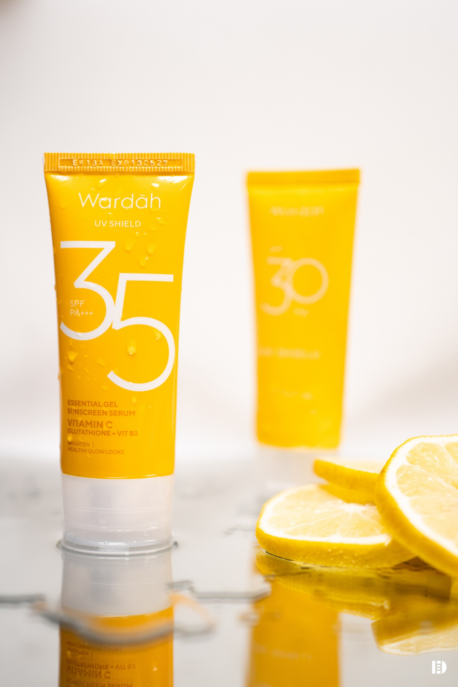

<!DOCTYPE html><html lang="id">
<head>
  <meta charset="UTF-8">
  <meta name="viewport" content="width=device-width, initial-scale=1.0">
  <title>Portofolio Saya</title>
  <link href="https://cdn.jsdelivr.net/npm/tailwindcss@2.2.19/dist/tailwind.min.css" rel="stylesheet">
  <link href="https://cdnjs.cloudflare.com/ajax/libs/lightbox2/2.11.3/css/lightbox.min.css" rel="stylesheet">
</head>
<body class="bg-gray-50 text-gray-800 font-sans">
  <!-- Navbar -->
  <header class="bg-white shadow-md sticky top-0 z-50">
    

      <h1 class="text-2xl font-bold">DIAN HANDAYANI SUTANTO</h1>
      <nav>
        <ul class="flex space-x-6">
          <li><a href="#beranda" class="hover:text-blue-600">Beranda</a></li>
          <li><a href="#tentang" class="hover:text-blue-600">Tentang</a></li>
          <li><a href="#portofolio" class="hover:text-blue-600">Portofolio</a></li>
          <li><a href="#kontak" class="hover:text-blue-600">Kontak</a></li>
        </ul>
      </nav>
    

  </header>  <!-- Beranda -->  <section id="beranda" class="text-center py-24 bg-gradient-to-b from-white to-gray-100">
    <h2 class="text-4xl font-bold mb-4">Halo, saya Dian Handayani Sutanto</h2>
    
Seorang kreator visual dan content creator muda yang terampil di bidang desain grafis, fotografi, dan media sosial, dengan pengalaman lintas organisasi, industri kreatif, dan produksi.

  </section>  <!-- Tentang -->  <section id="tentang" class="py-20 max-w-4xl mx-auto px-4">
    <h2 class="text-3xl font-semibold mb-6">Tentang Saya</h2>
    
Saya Dian Handayani Sutanto, lulusan SMK Negeri 1 Cileungsi jurusan Desain Komunikasi Visual. Saya memiliki pengalaman dalam desain grafis, fotografi, videografi, dan content creation, baik melalui kegiatan organisasi maupun dunia industri. Aktif sebagai tim dokumentasi di OSIS, saya turut membuat logo resmi dan mengelola media sosial sekolah.

Selama magang di Studio Foto Nayaka, saya terlibat dalam pembuatan desain merchandise, konten harian media sosial, serta editing foto dan video. Saya juga memiliki pengalaman dalam produksi dan quality control saat magang di PT Panasonic Gobel Life Solutions, yang melatih ketelitian dan efisiensi kerja.

Saya terbiasa bekerja dalam tim, beradaptasi dengan kebutuhan visual yang berbeda, dan mengutamakan hasil yang detail dan komunikatif. Saya siap berkontribusi di bidang kreatif, khususnya desain visual, fotografi, dan konten digital.

  </section>  <!-- Portofolio -->  <section id="portofolio" class="py-20 bg-gray-100">
    

      <h2 class="text-3xl font-semibold mb-10 text-center">Portofolio</h2>
      

        <!-- Tambahkan karya kamu di sini -->
        

          <a href="20250426_182458_0000.png" data-lightbox="galeri" data-title="Product Photography">
            
          
          </a>
          <h3 class="text-lg font-medium">Wardah Photography</h3>
          
Mengikuti sesi praktik fotografi produk untuk mengenal lebih dalam teknik pencahayaan, penataan objek, dan pengambilan gambar produk dengan hasil yang menarik secara visual. Digunakan sebagai materi belajar sekaligus aset untuk kebutuhan konten promosi studio.

        

        <!-- Ulangi untuk karya lain -->
      

    

  </section>  <!-- Kontak -->  <section id="kontak" class="py-20 max-w-4xl mx-auto px-4">
    <h2 class="text-3xl font-semibold mb-6">Kontak</h2>
    
Email: handayanisdian@gmail.com

    
Instagram: @dian.hys

  </section>  <footer class="bg-white text-center py-6 mt-12 text-sm text-gray-500">
    &copy; 2025 DVisuals. All rights reserved.
  </footer>  </body>
</html>
